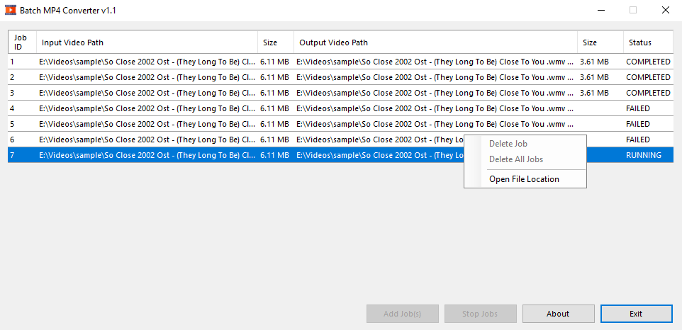

# BatchMp4Converter
### Version : 1.1

Author : Lakhya Jyoti Nath (ljnath) 
Date : Sept 2020 
Email : ljnath@ljnath.com 
Website : https://www.ljnath.com

  

## Introduction

 A simple and easy to use video converter for converting video files to MP4. Conversion is done using FFmpeg. 
 `libx264` and `aac` are used as output video and audio converter to achieve lower output filesize.  

## Features
- Easy to use
- Lightweight interface
- Supports batch and resume funtinality of conversion
- 1-click start and stop process
- Very small output filesize
- Update notification

## Prerequisite
- FFmpeg binary needs to be in the same location as the binary file.
[[Download FFmpeg]](https://ffmpeg.org/download.html)

## Screenshot

